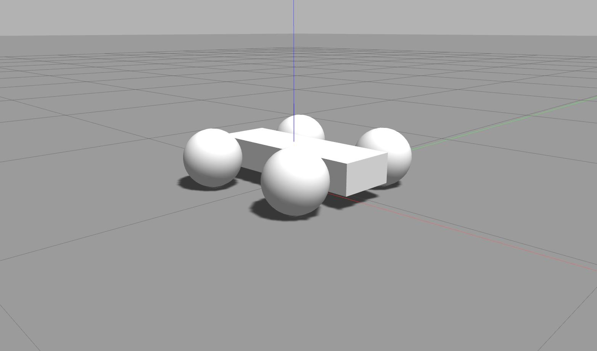

# Gazebo Models

This repository holds models for gazebo. Note that some of the models only functionally work with their plugins that need to be built first. Therefore, please have a look at the respective model sections below. To prepare the models for the use with Gazebo, please have a look at the [build section](#build)).

## Build

## Models

The repository holds following models.

 
<figure>
  

  <figcaption>Fig. 1: Models from left to right: Goal, obstacle, vehicle. </figcaption>
</figure>
  

## Vehicle

The vehicle makes use of plugins that need to be built as described in [gazebo_plugins](https://github.com/mhubii/gazebo_plugins).
