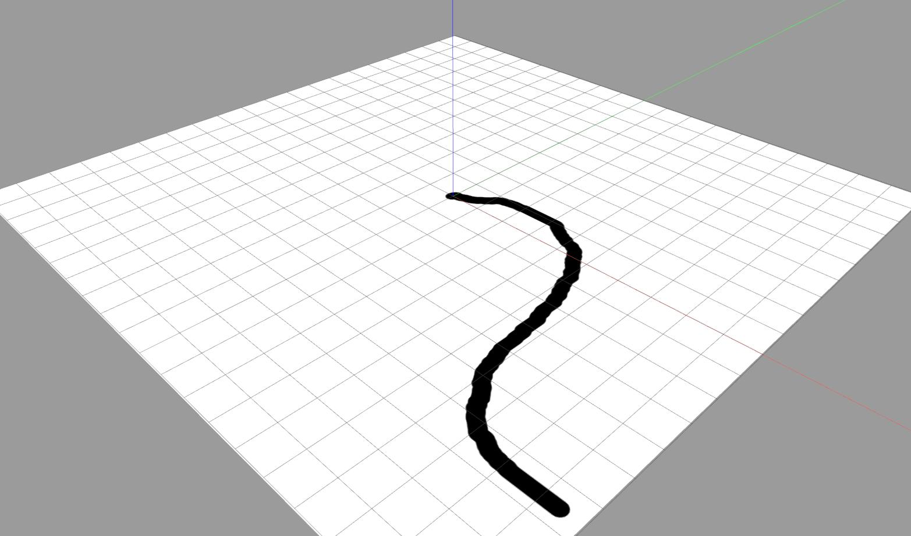

# Gazebo Models

This repository holds models for gazebo. Note that some of the models only functionally work with their plugins that need to be built first. Therefore, please have a look at the respective [model sections](#models) below. To prepare the models for the use with Gazebo, please have a look at the [build section](#build).

## Build

You can either install the models to a location that Gazebo knows, or update the path, where Gazebo is looking for models. Updating the path will usually keep your system cleaner.

### Update Path

Add this line to your `~/.bashrc`

```
export GAZEBO_MODEL_PATH=<location to which you cloned this repository>/gazebo_models:$GAZEBO_MODEL_PATH
```

### Install

You can also install the models. Note that this is not necessary if you already updated your path. To install the models do

```
mkdir build
cd build
cmake -DCMAKE_INSTALL_PREFIX=~/.gazebo ..
make install
```

To uninstall the models do

```
cd build
make uninstall
```

## Models

The repository holds following models

<br>
<figure>
  <p align="left"><br></p>
  <figcaption>Fig. 1: Models from left to right: Goal, obstacle, lined plane, vehicle, heicub. </figcaption>
</figure>
<br><br>

## Vehicle

The vehicle supports autonomous navigation, and keyboard controlled navigation. This only works if you built the plugins properly. Please follow the instructions in [gazebo_plugins](https://github.com/mhubii/gazebo_plugins).

## Heicub

Heicub supports autonomous navigation, and keyboard controlled navigation. You need to install [YARP](http://www.yarp.it/install.html), because it internally manages the communication for the hardware and this simulated model mirrors the behaviour of the real robot. Also, for YARP to communicate with Gazebo, you need to install the [gazebo-yarp-plugins](http://robotology.gitlab.io/docs/gazebo-yarp-plugins/master/install.html). 
Since the walking of the robot is based on Nonlinear Model Predictive Control, you also need to install the library that performs the optimization. Please follow the instructions in [nmpc_pattern_generator](https://github.com/mhubii/nmpc_pattern_generator.git).
