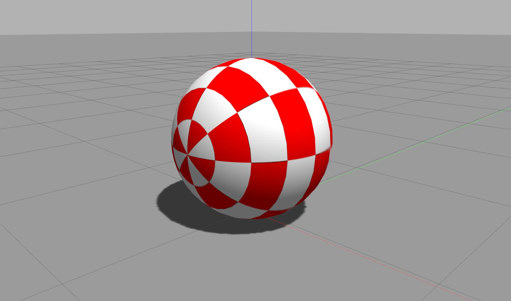

# Gazebo Models

This repository holds models for gazebo. Note that this repository is ment to be a submodule of [path_finding](https://github.com/mhubii/path_finding.git), and [nmpc_pattern_generator](https://github.com/mhubii/nmpc_pattern_generator). In order for some plugins to work properly, please clone these repositories recursively, or make sure to get your paths variable right on the build stage (see [Build](#build)).

## Build

## Models

The repository holds following models.

 
<figure>
  

  <figcaption>Fig. 1: Models from left to right: Goal, obstacle, vehicle. </figcaption>
</figure>
  
